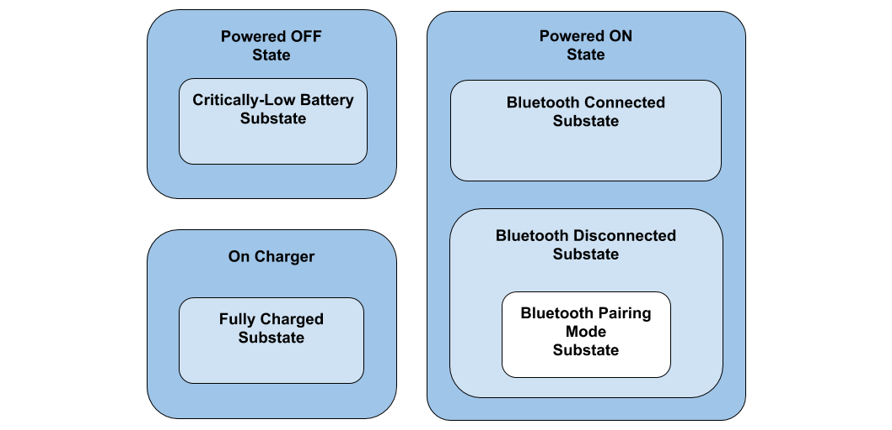

# HTHSM

## What is this?
HTHSM is a **framework for implementing heirarchical finite state machines (HSMs) in C** code. 

## Would I benefit from this?
If you're building something that operates in a handful of clear cut modes/states, then this project may be for you. This framework allows you to keep event-driven code orderly and readable.  An example candidate for using HTHSM is a bluetotoh device having the following states:



## How do I use it?
Based on the above example of a simple Bluetooth device:
```c
#include "HTHSM.h"

/*
Define and allocate memory for the the states using these macros:
    HTHSM_STATE_DEF(id, name)
    HTHSM_SUBSTATE_DEF(id, name, superstate)
The parameter 'id' is a numeric ID for debugging purposes
The parameter 'name' is how we reference the state later in the code below
The macro declares an event handler function that'll need to be implemented in the code below.
That function's name is its state's name suffixed with "_fxn"
*/
HTHSM_STATE_DEF(0, fsm_state_powerOff);
HTHSM_SUBSTATE_DEF(1, fsm_state_powerOff_criticallyLowBattery,  fsm_state_powerOff);
HTHSM_STATE_DEF(2, fsm_state_powerOn);
HTHSM_SUBSTATE_DEF(3, fsm_state_powerOn_connected,              fsm_state_powerOn);
HTHSM_SUBSTATE_DEF(4, fsm_state_powerOn_disconnected,           fsm_state_powerOn);
HTHSM_SUBSTATE_DEF(5, fsm_state_powerOn_pairingMode,            fsm_state_powerOn);
HTHSM_STATE_DEF(6, fsm_state_onCharger);
HTHSM_SUBSTATE_DEF(7, fsm_state_onCharger_fullyCharged,         fsm_state_onCharger);

static HTHSM_Fsm stateMachine;

/*
Define the events that your states react to
*/
enum {
    SIG_BUTTON_PUSH = HTHSM_SIG_USER_START,
    SIG_BUTTON_REALEASE,
    SIG_SHORT_BUTTON_PRESS,
    SIG_LONG_BUTTON_PRESS_1,
    SIG_LONG_BUTTON_PRESS_2,
    SIG_CENTRAL_CONNECTED,
    SIG_CENTRAL_DISCONNECTED,
    SIG_CENTRAL_BONDED,
    SIG_PLACED_ON_CHARGER,
    SIG_REMOVED_FROM_CHARGER,
    SIG_CHARGING_COMPLETED,
    SIG_SECOND_TIMER_TICK,
    SIG_GENERAL_PURPOSE_TIMER_FIRED,
    SIG_PERIODIC_BATTERY_LEVEL_CHECK,
    SIG_LOW_BATTERY,
    SIG_BLUETOOTH_MESSAGE_RX,
};

// eventHandler is always executed in the "main" context
void eventHandler(HTHSM_Event * pEvent){
    HTHSM_Dispatch(&stateMachine, pEvent);
}

/* 
Implementations of each state's event handling function
*/
static HTHSM_return_t fsm_state_powerOff_fxn (HTHSM_Fsm * me, HTHSM_Event const * pEvent)
{
    HTHSM_Event event;
    switch (pEvent->sig)
    {
        case HTHSM_SIG_ENTRY:
            // Disable the LED, sensors, etc
            led_setColor(OFF);
            // enter a low power state
            enterDeepSleep();
            // Poll to see if the device is on the charger
            if(IS_ON_CHARGER()){
                event.sig = SIG_PLACED_ON_CHARGER;
                queue_enqueue(&event);
            }
            break;
            
        case HTHSM_SIG_EXIT:
            break;
            
        case SIG_LONG_BUTTON_PRESS_1:
            HTHSM_Transition(me, fsm_state_powerOn);
            break;
            
        case SIG_LONG_BUTTON_PRESS_2:
            HTHSM_Transition(me, fsm_state_powerOn_pairingMode);
            break;
            
        case SIG_PLACED_ON_CHARGER:
            HTHSM_Transition(me, fsm_state_onCharger);
            break;
            
        default:
            break;
    }
    return HTHSM_CONTINUE;
}

static HTHSM_return_t fsm_state_powerOff_criticallyLowBattery_fxn (HTHSM_Fsm * me, HTHSM_Event const * pEvent)
{
    // This is a substate of fsm_state_powerOff
    switch (pEvent->sig)
    {
        case HTHSM_SIG_ENTRY:
            break;
            
        case HTHSM_SIG_EXIT:
            stopTimer();
            led_setColor(OFF);
            break;
            
        case SIG_LONG_BUTTON_PRESS_1:
            led_setColor(RED);
            startTimer(1000); // turn off the LED in 1000 milliseconds
            // Bypass the PowerOff superstate's implementation
            // Precenting the device from turning on
            return HTHSM_SUPPRESS_SUPERSTATES; 
            
        case SIG_GENERAL_PURPOSE_TIMER_FIRED:
            led_setColor(OFF);
            break;
            
        default:
            break;
    }
    return HTHSM_CONTINUE;
}

static HTHSM_return_t fsm_state_powerOn_fxn (HTHSM_Fsm * me, HTHSM_Event const * pEvent)
{
    HTHSM_Event event;
    switch (pEvent->sig)
    {
        case HTHSM_SIG_ENTRY:
            led_setColor(BLUE);
            sensors_enable();
            break;
            
        case HTHSM_SIG_EXIT:
            led_setColor(OFF);
            sensors_disable();
            break;
           
        case SIG_LONG_BUTTON_PRESS_1:
            HTHSM_Transition(me, fsm_state_powerOff);
            break;
            
        case SIG_PERIODIC_BATTERY_LEVEL_CHECK:
            int batteryPercentage = battery_readCapacity();
            if(batteryPercentage < 20){ 
                event.sig = SIG_LOW_BATTERY;
                queue_enqueue(&event); 
            }
            break;
        
        case SIG_LOW_BATTERY:
            HTHSM_Transition(me, fsm_state_powerOff_criticallyLowBattery);
            break;
            
        default:
            break;
    }
    return HTHSM_CONTINUE;
}

static HTHSM_return_t fsm_state_powerOn_disconnected_fxn (HTHSM_Fsm * me, HTHSM_Event const * pEvent)
{
    switch (pEvent->sig)
    {
        case HTHSM_SIG_ENTRY:
            bluetoothAdvertising_enable();
            break;
            
        case HTHSM_SIG_EXIT:
            bluetoothAdvertising_disable();
            break;
        
        case SIG_CENTRAL_CONNECTED:
            HTHSM_Transition(me, fsm_state_powerOn_connected);
        
        default:
            break;
    }
    return HTHSM_CONTINUE;
}

static HTHSM_return_t fsm_state_powerOn_connected_fxn (HTHSM_Fsm * me, HTHSM_Event const * pEvent)
{
    switch (pEvent->sig)
    {
        case HTHSM_SIG_ENTRY:
            break;
        case HTHSM_SIG_EXIT:
            break;
        
        case SIG_CENTRAL_DISCONNECTED:
            HTHSM_Transition(me, fsm_state_powerOn_disconnected);
        
        case SIG_BLUETOOTH_MESSAGE_RX:
            processBluetoothMessage(pEvent->param);
            break;
            
        default:
            break;
    }
    return HTHSM_CONTINUE;
}

/*
Implement the other states' event handler functinos
...
*/

/*
Examples of interrupts that queue an event
to be processed by the state machine in the main context
*/
void button_interrupt(bool pressed){
    HTHSM_Event event;
    event.sig = pressed ? SIG_BUTTON_PUSH : SIG_BUTTON_RELEASE;
    queue_enqueue(&event);
}

void timer_fired(){
    HTHSM_Event event;
    event.sig = SIG_GENERAL_PURPOSE_TIMER_FIRED;
    queue_enqueue(&event);
}

int main(void){
    /*
    Construct and initialize the FSM
    fsm_state_powerOff is the starting state
    */
    HTHSM_FsmCtor(&stateMachine, fsm_state_powerOff, NULL);
    HTHSM_FsmInit(&stateMachine);
    
    // Main loop    
    for (;;)
    {
        // idle() stays in a low-power state until there's an event
        idle(); 
        while( !queue_empty() ){
            HTHSM_Event event = queue_dequeue();
            eventHandler(&event);
        }
    }
}


```
